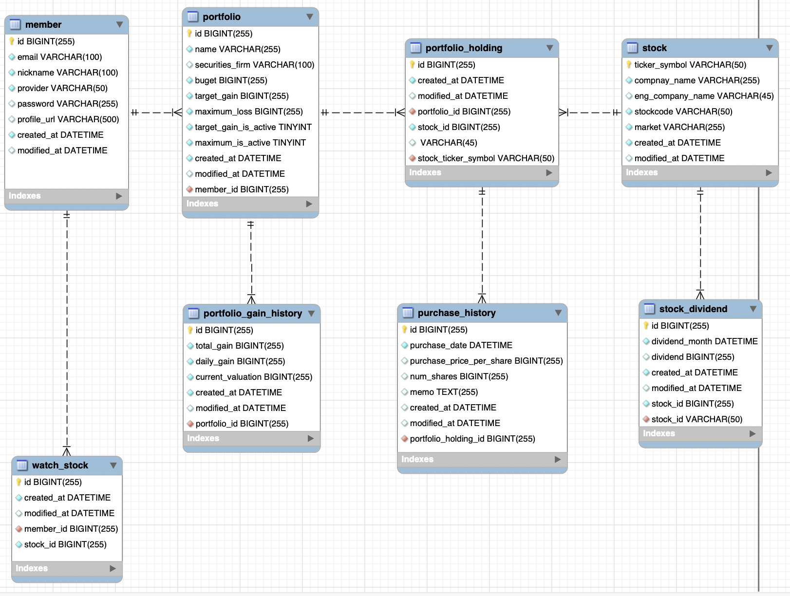

### 개발환경
- Java 11
- Spring Boot 2.7
- JPA
- MySQL, Redis
- AWS EC2, S3
- Docker

### Open API
- 한국 투자 증권
- Oauth Naver, Kakao, Google

### 협업 툴
- Slack
- Obisidian
- Github Project

### 기타
- MySQL Workbench
- Postman
- Github Action

### 아키텍처

### ERD
