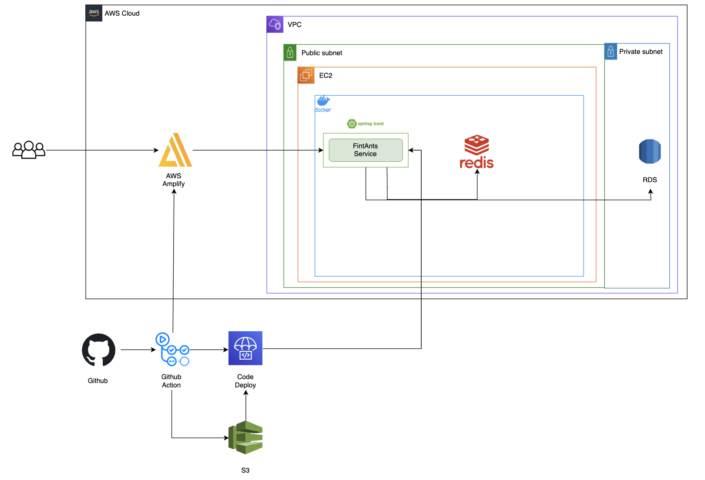

### 개발환경
- Java 11
- Spring Boot 2.7
- JPA
- MySQL, Redis

### 배포 도구
- Docker
- AWS EC2, 
- AWS ERD, 
- AWS Code Deploy
- AWS S3

### Open API
- 한국 투자 증권
- Oauth Naver, Kakao, Google

### 협업 툴
- Slack
- Obisidian
- Github Project

### 기타
- MySQL Workbench
- Postman
- Github Action

### 아키텍처_v1

### 아키텍처_v2

### ERD
